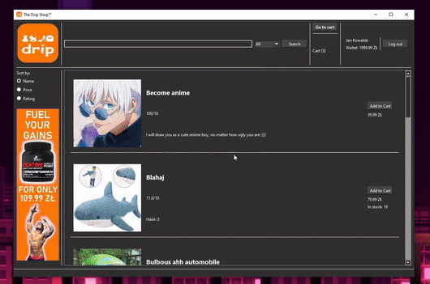

# The Drip Shop

## DISCLAIMER

This project was originally made by me and my friend for our OOP classes. Afterwards I have decided to fork the repository and extensively rewrite almost every aspect of the app, so the **vast** majority of the codebase was written by me, but feel free to check the commit history.

## Introduction

This is a desktop app made to simulate the usage of a simple web store. It was created using Qt with C++.

The user is able to:

- sort and filter the display of buyables based on name, price, type, etc
- add various buyables to cart
- purchase said buyables using a wallet or fake card information
- log in and log out of their account
- create a new account

## Running the app

The simplest way to run the app is to open the `shop_project.pro` using Qt Creator and run it there.
You can also compile and run a standalone executable, but it requires the following Qt libraries to be present:

- `Qt6Core.dll`
- `Qt6Gui.dll`
- `Qt6Widgets.dll`

Note: Asset paths are relative and assume the app is run from the build directory in the default Qt Creator project structure.

If setting it up is too much hassle, I’ve included a video demo of all of the core features:

[Demo video link (file too large for a direct embed)](https://www.youtube.com/watch?v=eDrE0IVixMk)
